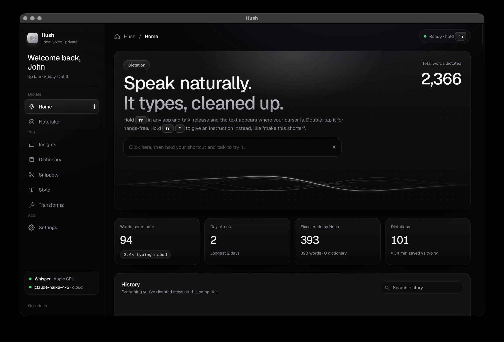

# Hush

**Talk instead of typing, in any app.** Hold a shortcut, speak, let go: Hush transcribes what you said, cleans it up (fillers gone, self-corrections applied, punctuation fixed) and pastes it where your cursor is.



- **Private by default.** Speech-to-text runs on your computer (Whisper). Cleanup runs locally too (Ollama), or, if you choose, on Claude for smarter results.
- **No account, no subscription.** Free and open source (GPL-3.0).
- **Windows and macOS** (Apple Silicon).

## Install

### Windows 10/11

1. Install **Python 3.12** (if you don't have it): open PowerShell and run
   ```
   winget install Python.Python.3.12
   ```
2. Install **Ollama** for offline cleanup (optional if you'll use Claude): [ollama.com/download](https://ollama.com/download), then in a terminal: `ollama pull qwen2.5:7b-instruct`
3. Download Hush: **Code → Download ZIP** on this page (or `git clone`), and unzip it somewhere permanent, e.g. `C:\Users\<you>\hush`.
4. Double-click **`run.bat`**. The first run installs everything (a few minutes) and downloads the speech model (~1.6 GB).

After that, Hush is in your **Start menu**. Pin it, and turn on **Settings → Open Hush when you log in** so your shortcut always works. An NVIDIA GPU makes transcription near-instant; it also works on CPU.

### macOS (Apple Silicon, no admin rights needed)

Open **Terminal** and run:
```bash
curl -LsSf https://astral.sh/uv/install.sh | sh && ~/.local/bin/uv python install 3.12
git clone https://github.com/jhwn72/hush-dictation.git ~/hush && cd ~/hush && ./run.sh
```
(Or download the ZIP, unzip it to `~/hush`, and run `cd ~/hush && ./run.sh`.)

This sets everything up and installs **Hush.app** in `~/Applications`. After that, open Hush from Spotlight or Launchpad, or drag it to your Dock. You can close Terminal.

Then, once:
- **System Settings → Privacy & Security**: allow **Hush** under **Microphone**, **Accessibility** and **Input Monitoring**, then quit and reopen Hush.
- **System Settings → Keyboard**: set **Press 🌐 key to: Do Nothing** (Hush uses fn).
- Optional, for offline cleanup: install [Ollama](https://ollama.com/download) and run `ollama pull qwen2.5:7b-instruct`.

## Use it

| Action | Windows | macOS |
|---|---|---|
| Dictate | hold `Ctrl` + `Win` | hold `fn` (🌐) |
| Hands-free | double-tap the shortcut, tap again to stop | same |
| Command mode: rewrite selected text ("make this shorter"), or write something ("reply saying Thursday works") | hold `Ctrl` + `Win` + `Alt` | hold `fn` + `⌃` |
| Cancel | `Esc` while recording | same |
| Transform selected text | `Win` + `Alt` + `1`–`9` | `⌘` + `⌥` + `1`–`9` |

All shortcuts can be changed in **Settings → Shortcuts**. If another dictation app uses the same shortcut, quit it or pick a different one.

**Voice commands**, said at the end: *"press enter"* / *"send it"* (paste, then send), *"scratch that"* (drop the last sentence; on its own, removes the previous dictation), *"new line"* / *"new paragraph"*.

Closing the window keeps Hush running in the background so the shortcut works; use **Quit Hush** in the sidebar to exit.

## Features

- **Smart cleanup** that reads the room: it uses the text around your cursor and on screen to fix names and mishearings, and matches the app (chat vs. email vs. AI prompt).
- **Whisper mode**: dictate quietly; soft speech is boosted.
- **Dictionary**: your names and jargon, spelled right. Fix a word once after dictating and Hush learns it (✨).
- **Snippets**: say a trigger phrase, get saved text (links, addresses, boilerplate).
- **Style and app rules**: formal/casual per type of app, plus your own rules ("In Slack, never end with a period").
- **Transforms**: Polish, Prompt Engineer, or your own, on any selected text.
- **Notetaker**: record a meeting; on Windows it hears both sides of a call and writes a Me / Them transcript, summary and action items.
- **Insights**: words per minute, time saved, weekly recap, streaks.
- **Cleanup brain**: local (Ollama) or Claude (paste your own Anthropic API key in Settings; stored in the system keychain, falls back to local when offline).

## Privacy

Everything you dictate, your history, dictionary, snippets and settings stay on your computer in `%APPDATA%\Hush` (Windows) or `~/Library/Application Support/Hush` (macOS). Nothing is sent anywhere unless you select **Claude** as the cleanup model, in which case your dictated text and the on-screen context used for cleanup go to Anthropic. Screen reading ("read the room") and learning from corrections can be switched off in Settings.

## Troubleshooting

- **Nothing pastes / shortcut does nothing (Mac):** check the three permissions above are on for Hush, then quit and reopen it.
- **"Cleanup model unreachable":** install Ollama (and pull the model), or choose Claude in Settings → Cleanup model.
- **Logs:** `flow.log` in the data folder above (Settings → Data → Open data folder).

## Development

```
hotkey (pynput) → mic (sounddevice) → Whisper (faster-whisper on CUDA / mlx-whisper on Mac)
  → dictionary → cleanup (Ollama or Claude) → snippets → style / app rules → paste
```

| Piece | File |
|---|---|
| App, JS bridge, pipelines | `hush/app.py` |
| Speech-to-text, streaming | `hush/stt.py`, `hush/streaming.py` |
| Cleanup / command / meeting prompts | `hush/llm.py` |
| Dictionary, snippets, voice commands, style | `hush/textproc.py` |
| Shortcuts | `hush/hotkeys.py` |
| Screen context, paste, app detection | `hush/context_win.py`, `hush/context_mac.py`, `hush/platform_utils.py` |
| Recording pill | `hush/pill_core.py`, `hush/pill_win.py`, `hush/pill_mac.py` |
| UI | `ui/` |

Tests live in `tools/` (e.g. `python tools/hotkeytest.py`, `tools/voicecmdtest.py`, `tools/learntest.py`; `tools/selftest.py` runs the full pipeline on synthesized speech).

## License

GPL-3.0. See [LICENSE](LICENSE).
